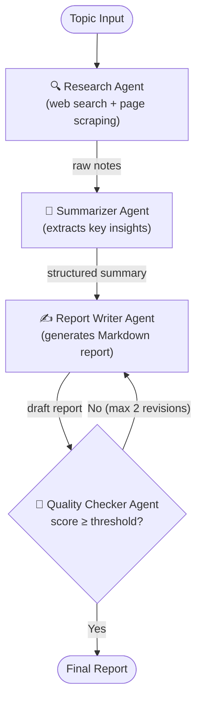

# Multi-Agent Autonomous Research System

> Orchestrate four specialised AI agents to research any topic, synthesise findings, write a structured report, and self-validate — fully autonomously.

---

## Architecture



### Orchestration Backends

| Backend | Description |
|---------|-------------|
| **CrewAI** | Crew of 4 agents running sequentially with shared memory |
| **LangGraph** | Directed state machine with conditional revision loop |
| **Both** | Run both backends and compare outputs |

---

## Features

- **Autonomous pipeline** — topic in, polished Markdown report out; no human steps required
- **Self-healing feedback loop** — Quality Checker scores each draft and routes it back to the Report Writer (up to 2 revisions) until the quality threshold is met
- **Dual orchestration backends** — swap between CrewAI and LangGraph, or run both and diff the outputs
- **Streaming support** — live intermediate results when using the LangGraph backend (`--stream`)
- **Pluggable search** — Tavily AI search (recommended) with automatic DuckDuckGo fallback (no key required)
- **Persistent checkpoints** — LangGraph state is saved to SQLite so long runs survive restarts
- **Structured reports** — every output includes Executive Summary, Key Findings, Analysis, Conclusions, and References
- **Rich CLI** — progress spinners, coloured logging, and configurable verbosity via `rich`
- **Metadata snapshots** — optional JSON sidecar with run stats, scores, and timing (`--save-metadata`)

---

## Tech Stack

| Layer | Library | Version |
|-------|---------|---------|
| Agent framework | [CrewAI](https://github.com/crewAIInc/crewAI) | `>=0.86.0,<1.0` |
| Agent framework | [LangGraph](https://github.com/langchain-ai/langgraph) | `>=0.2.0,<2.0` |
| State persistence | langgraph-checkpoint-sqlite | `>=3.0.0` |
| LLM integration | [LangChain](https://github.com/langchain-ai/langchain) | `>=0.3.0` |
| LLM integration | langchain-openai | `>=0.2.0` |
| LLM provider | [OpenAI Python SDK](https://github.com/openai/openai-python) | `>=1.40.0` |
| Web search | [Tavily Python](https://github.com/tavily-ai/tavily-python) | `>=0.3.0` |
| Web search (fallback) | duckduckgo-search | `>=6.0.0` |
| HTML parsing | BeautifulSoup4 + lxml | `>=4.12.0` / `>=5.0.0` |
| Settings | Pydantic Settings | `>=2.3.0` |
| Retry logic | Tenacity | `>=8.3.0` |
| Console UI | Rich | `>=13.7.0` |
| Token counting | tiktoken | `>=0.7.0` |
| Testing | pytest + pytest-asyncio | `>=8.0.0` / `>=0.23.0` |
| Runtime | Python | `3.11+` |

---

## Setup

### 1. Clone the repository

```bash
git clone https://github.com/Danny18-ops/multi-agent-research-system.git
cd multi-agent-research-system
```

### 2. Create a virtual environment

```bash
python3.11 -m venv .venv
source .venv/bin/activate        # Windows: .venv\Scripts\activate
```

### 3. Install dependencies

```bash
pip install -r requirements.txt
```

### 4. Configure environment variables

```bash
cp .env.example .env
# Open .env and fill in your API keys
```

| Variable | Required | Description |
|----------|----------|-------------|
| `OPENAI_API_KEY` | **Yes** | [OpenAI API key](https://platform.openai.com/api-keys) |
| `TAVILY_API_KEY` | No | [Tavily search key](https://tavily.com) — falls back to DuckDuckGo if absent |
| `OPENAI_MODEL` | No | Model name (default: `gpt-4o`) |
| `OPENAI_TEMPERATURE` | No | Sampling temperature (default: `0.1`) |
| `MAX_SEARCH_RESULTS` | No | Results per query (default: `5`) |
| `MAX_ITERATIONS` | No | Max agent steps (default: `10`) |
| `MIN_QUALITY_SCORE` | No | Revision threshold 0–1 (default: `0.7`) |
| `OUTPUT_DIR` | No | Report output directory (default: `outputs`) |
| `LOG_LEVEL` | No | Logging verbosity (default: `INFO`) |

### 5. Run your first research task

```bash
python main.py "The impact of artificial intelligence on drug discovery"
```

---

## Usage Examples

```bash
# Default — CrewAI backend
python main.py "The impact of artificial intelligence on drug discovery"

# LangGraph backend with live streaming
python main.py "Quantum computing breakthroughs in 2024" --backend langgraph --stream

# Run both backends and compare outputs
python main.py "Future of renewable energy" --backend both

# Save a JSON metadata sidecar alongside the report
python main.py "Blockchain in supply chain" --save-metadata

# Custom output directory and debug logging
python main.py "CRISPR gene editing" --output-dir ./my-reports --log-level DEBUG
```

### CLI Reference

```
usage: main.py [-h] [--backend {crewai,langgraph,both}]
               [--stream] [--output-dir OUTPUT_DIR]
               [--log-level {DEBUG,INFO,WARNING,ERROR}]
               [--save-metadata]
               topic

positional arguments:
  topic                 Research topic or question to investigate

options:
  --backend             Orchestration backend (default: crewai)
  --stream              Stream intermediate results (LangGraph only)
  --output-dir DIR      Override output directory
  --log-level LEVEL     Override log verbosity
  --save-metadata       Save a JSON metadata file alongside the report
```

---

## Project Structure

```
multi-agent-research-system/
├── src/
│   ├── agents/
│   │   ├── research_agent.py        # Web research specialist
│   │   ├── summarizer_agent.py      # Information synthesiser
│   │   ├── report_writer_agent.py   # Technical report writer
│   │   └── quality_checker_agent.py # QA editor & fact-checker
│   ├── tools/
│   │   ├── search_tools.py          # Tavily + DuckDuckGo search
│   │   ├── web_scraper.py           # HTML → clean text extractor
│   │   └── file_tools.py            # Read/write outputs to disk
│   ├── workflows/
│   │   ├── research_workflow.py     # CrewAI crew orchestration
│   │   └── langgraph_workflow.py    # LangGraph state machine
│   └── config/
│       ├── settings.py              # Pydantic settings (env vars)
│       └── logging_config.py        # Rotating file + console logging
├── tests/                           # pytest test suite
├── outputs/                         # Generated reports (auto-created)
├── logs/                            # Log files (auto-created)
├── main.py                          # CLI entry point
├── requirements.txt
├── .env.example
└── README.md
```

### Output Files

Reports are saved as Markdown files in `outputs/`:

```
outputs/
├── report_<topic>_<timestamp>.md
├── crewai_report_<timestamp>.md
├── langgraph_report_<timestamp>.md
└── run_metadata_<timestamp>.json    # with --save-metadata
```

Each report contains:

1. Executive Summary
2. Background & Context
3. Key Findings
4. Analysis & Implications
5. Conclusions & Recommendations
6. References

---

## Development

```bash
# Format
black src/ main.py

# Lint
ruff check src/ main.py

# Type-check
mypy src/ main.py

# Run tests
pytest tests/ -v
```

### Extending the System

**Add a new agent**
1. Create `src/agents/my_agent.py` following the existing factory pattern.
2. Export it from `src/agents/__init__.py`.
3. Add a corresponding `Task` in `src/workflows/research_workflow.py`.

**Add a new tool**
1. Create `src/tools/my_tool.py` subclassing `crewai.tools.BaseTool`.
2. Export it from `src/tools/__init__.py`.
3. Pass the tool instance to the relevant agent's `tools` list.

**Switch search backend**
- **Tavily** (recommended): set `TAVILY_API_KEY` in `.env`.
- **DuckDuckGo** (default, no key): leave `TAVILY_API_KEY` blank.
- **Custom**: implement `BaseTool` and inject into `ResearchWorkflow._build_tools()`.

---

## Future Improvements

- [ ] **Citation verification** — fact-check claims against source URLs before finalising the report
- [ ] **Multi-LLM routing** — assign different models to different agents based on cost/capability trade-offs (e.g. GPT-4o for writing, GPT-4o-mini for summarising)
- [ ] **Async parallel research** — fan-out multiple Research Agent instances across sub-topics simultaneously
- [ ] **Vector memory store** — persist agent memory across runs with a ChromaDB or Pinecone backend
- [ ] **Web UI / API server** — FastAPI wrapper with WebSocket streaming and a simple React front-end
- [ ] **PDF & DOCX export** — render the Markdown report to publication-ready formats
- [ ] **Scheduled research** — cron-based trigger to track a topic over time and diff successive reports
- [ ] **Evaluation harness** — automated benchmarks to measure report quality across topics and models

---

## License

MIT License

Copyright (c) 2024 Danny18-ops

Permission is hereby granted, free of charge, to any person obtaining a copy
of this software and associated documentation files (the "Software"), to deal
in the Software without restriction, including without limitation the rights
to use, copy, modify, merge, publish, distribute, sublicense, and/or sell
copies of the Software, and to permit persons to whom the Software is
furnished to do so, subject to the following conditions:

The above copyright notice and this permission notice shall be included in all
copies or substantial portions of the Software.

THE SOFTWARE IS PROVIDED "AS IS", WITHOUT WARRANTY OF ANY KIND, EXPRESS OR
IMPLIED, INCLUDING BUT NOT LIMITED TO THE WARRANTIES OF MERCHANTABILITY,
FITNESS FOR A PARTICULAR PURPOSE AND NONINFRINGEMENT. IN NO EVENT SHALL THE
AUTHORS OR COPYRIGHT HOLDERS BE LIABLE FOR ANY CLAIM, DAMAGES OR OTHER
LIABILITY, WHETHER IN AN ACTION OF CONTRACT, TORT OR OTHERWISE, ARISING FROM,
OUT OF OR IN CONNECTION WITH THE SOFTWARE OR THE USE OR OTHER DEALINGS IN THE
SOFTWARE.
